# Báo cáo Audit Database — Yedi/Tidal API (Laravel 11)

**Phạm vi:** Static review 49 migrations (`database/migrations/`), 26 models (`app/Models/`), 2 seeders (`database/seeders/`).
**Trạng thái:** Chỉ phân tích schema tĩnh. Mọi thứ ghi "cần verify trên DB" cần chạy `migrate` sạch + kiểm tra volume/dữ liệu thật.
**Nghiêm trọng:** 🔴 Critical · 🟠 High · 🟡 Medium · 🟢 Low

---

## 0. Bối cảnh engine (rất quan trọng)

- `config/database.php:19` → `'default' => env('DB_CONNECTION', 'sqlite')`. **Default là SQLite.** `phpunit.xml:25` set `DB_DATABASE=testing` (không set `DB_CONNECTION` → chạy test trên connection default). **cần verify trên DB**: production dùng MySQL hay SQLite (ảnh hưởng lớn tới FK/index/`->change()` bên dưới).
- Hệ quả engine-dependent:
  - **MySQL/InnoDB tự tạo index cho mọi FK.** **SQLite KHÔNG** → nếu prod/test chạy SQLite thì tất cả cột `..._id` qua `->constrained()` **không có index** ⇒ full-scan khi filter (vd `applications.advert_id`).
  - SQLite mặc định **không bật FK enforcement** (`PRAGMA foreign_keys`); cascade/restrict có thể không thực thi ⇒ mọi ràng buộc chỉ còn app-level. **cần verify trên DB**.
  - `->change()` (đổi kiểu cột) trên SQLite recreate-table và **không convert dữ liệu** (SQLite typeless).

---

## 1. Data model tái dựng (bảng + quan hệ)

### Nhóm identity/auth
| Bảng | PK | Cột chính | FK | Unique | Index | Soft-del |
|---|---|---|---|---|---|---|
| `users` | bigint id | type, first/last/**name** (trùng lặp), email, password, title, date_of_birth, telephone, **nullableMorphs(userable)**, new_email/new_email_code/expires, is_super_admin | userable (morph, no FK) | email | type, userable_type/id, last_activity(sessions) | ✅ |
| `password_reset_tokens` | email | token | — | — | — | ❌ |
| `sessions` | id(str) | user_id, ip, payload | user_id (index, no constraint) | — | user_id, last_activity | ❌ |
| `personal_access_tokens` | bigint | tokenable morph, token | tokenable (morph) | token | morphs | ❌ |
| `device_tokens` | bigint | user_id, device_token, **last_used TEXT NOT NULL** | user_id → users **cascade** | device_token | user_id(FK) | ❌ |

### Nhóm actor nghiệp vụ
| Bảng | PK | FK chính | Ràng buộc | Soft-del |
|---|---|---|---|---|
| `advertisers` | bigint | address_id→addresses(null), photograph_id→uploads(uuid,null) | compliance_status idx, profile_status idx | ✅ |
| `applicants` | bigint | address_id(null), photograph_id/evidence_of_id_id/video_verification_id→uploads(uuid,null), type_of_work_id(null), job_role_id(null) | compliance_status/profile_status idx, rating decimal | ✅ |
| `adverts` | bigint | advertiser_id→advertisers **cascade**, address_id→addresses **restrict** | type/status/marked_as_completed_at idx; `advertiser_pay_rate` **JSON** | ✅ |
| `shifts` | bigint | advert_id→adverts **cascade** | starts_at/ends_at | ✅ |
| `applications` | bigint | applicant_id **cascade**, advert_id **cascade** | status idx, actioned_at datetime, rating tinyint | ✅ |
| `hearted_applicants` | bigint | advertiser_id **cascade**, applicant_id **cascade** | — | ✅ |

### Nhóm compliance / hồ sơ (PII)
| Bảng | FK | Ghi chú |
|---|---|---|
| `references` | applicant_id **cascade**, upload_id(null) | +30 cột reference (safeguarding, disciplinary, `not_suitable_to_work_with_under_18s`, chữ ký `signature` mediumText), `reference_id` uuid (không unique), `status` |
| `declarations` | upload_id(null) | required default true |
| `declaration_agreements` | declaration_id **cascade**, applicant_id **cascade** | pivot |
| `right_to_work_declarations` | applicant_id **cascade** | 4 boolean (visa, tiền án…) |
| `required_evidence` | — | catalog |
| `applicant_evidence` | applicant_id/required_evidence_id/upload_id **cascade** | pivot bằng chứng (DBS/ID) |
| `video_verifications` | applicant_id **cascade**, upload_id(null) **cascade** | `code` |

### Nhóm tài chính
| Bảng | FK | Money |
|---|---|---|
| `invoices` | advert_id **cascade**, upload_id(null) | `sub_total/vat/total` **JSON** (MoneyCast), `due_date` default tĩnh, `invoice_number` (không unique) |
| `invoice_items` | invoice_id **cascade** | `rate/amount` **JSON**, `quantity` decimal (sau fix), `rate_type` enum-string |
| `payslips` | advert_id/applicant_id **cascade**, upload_id(null) | `payslip_number` (không unique) |

### Nhóm tệp/địa chỉ/tài liệu (polymorphic)
| Bảng | PK | owner morph | Ghi chú |
|---|---|---|---|
| `uploads` | **uuid** | nullableMorphs(owner) | uploaded_by_id→users(null), `expires_at` idx (TTL), image_width/height |
| `image_conversions` | **uuid** | — | upload_id uuid→uploads **cascade** |
| `addresses` | bigint | nullableMorphs(owner) | lat/long decimal(10,7), `expires_at` idx (TTL) |
| `documents` | bigint | morphs(owner) | upload_id **cascade** |
| `contracts` | bigint | morphs(owner) | upload_id(null) |

### Nhóm catalog / cấu hình / hệ thống
`job_roles`, `types_of_work`, `settings` (singleton — không có ràng buộc), `audits` (owen-it), `cache`/`cache_locks`, `jobs`/`job_batches`/`failed_jobs`.

---

## 2. Schema hygiene & red flags

### 🔴 F-DB-01 — `applications` không có unique(applicant_id, advert_id) → double-apply
`2025_01_09_142726_create_applications_table.php:432-440`. Không unique composite ⇒ 1 applicant apply cùng 1 advert nhiều lần. Đây là **race condition kinh điển** (2 request song song đều pass check `exists()` ở app rồi cùng insert). Soft-delete càng làm phức tạp (unique phải tính cả `deleted_at`).
**Fix:** `unique(['applicant_id','advert_id','deleted_at'])` + bắt lỗi 23000; hoặc partial unique index (Postgres) `WHERE deleted_at IS NULL`.

### 🔴 F-DB-02 — Money lưu dạng JSON (Brick Money) → mất khả năng toàn vẹn & tính toán ở DB
`invoices.sub_total/vat/total`, `invoice_items.rate/amount`, `adverts.advertiser_pay_rate` đều `json`. `app/Casts/MoneyCast.php`.
Hệ quả: (a) không `SUM/AVG`/aggregate/report bằng SQL; (b) không có CHECK numeric — mọi validation ở app; (c) `MoneyCast::get()` gọi `json_decode($value)->amount` **không null-check** ⇒ nếu cột null hoặc JSON hỏng → fatal khi hydrate model; (d) currency lưu per-row, không ràng buộc đồng nhất; (e) không index/so sánh khoảng giá được.
**Fix:** đổi sang `bigInteger amount_minor` + `char(3) currency` (2 cột); giữ MoneyCast map 2 cột. Nếu bắt buộc JSON, tối thiểu thêm null-guard trong cast và NOT NULL default.

### 🟠 F-DB-03 — `fix_invoice_items_quantity_column`: quantity ban đầu bị tạo nhầm là JSON
`2025_02_03_155715_add_new_invoice_fields.php:1645` tạo `quantity` là `json` (copy-paste MoneyCast), rồi `2025_02_04_101446_fix_invoice_items_quantity_column.php:1720` đổi `->decimal('quantity')->change()`. Nếu đã có dữ liệu JSON string, `->change()` sang decimal sẽ lỗi/hỏng số liệu (MySQL cast `'{"amount":..}'`→0; SQLite giữ nguyên text). Vì cùng cửa sổ deploy nên có thể chưa có data. **cần verify trên DB** (đếm `invoice_items` cũ).

### 🟠 F-DB-04 — `convert_application_actioned_at_to_date_time`: nguy cơ mất dữ liệu khi convert string→dateTime
`2025_01_22_102219:870` đổi `actioned_at` từ `string`→`dateTime` qua `->change()`. Trên MySQL, string không parse được thành datetime → thành `0000-00-00`/NULL/lỗi strict. Bản gốc `2025_01_09_142726:437` lưu string. **cần verify trên DB** giá trị `actioned_at` có đúng datetime không.

### 🟠 F-DB-05 — Hai migration trùng timestamp `2025_01_24_093814` (invoices + payslips)
Laravel sort theo tên file: tie-break `create_invoices_table` < `create_payslips_table` (i<p) ⇒ invoices chạy trước. Hiện **an toàn** vì payslips không tham chiếu invoices. Nhưng đây là fragility: nếu sau này thêm phụ thuộc chéo, thứ tự trong cùng batch không đảm bảo. **Fix:** đổi timestamp để tách thứ tự rõ ràng.

### 🟠 F-DB-06 — Thiếu unique cho các bảng pivot/định danh
- `hearted_applicants` (`:1324`): thiếu unique(advertiser_id, applicant_id) → tim trùng.
- `declaration_agreements` (`:539`): thiếu unique(declaration_id, applicant_id) → đồng ý trùng.
- `applicant_evidence` (`:643`): thiếu unique(applicant_id, required_evidence_id).
- `invoice_number` (`:1041`) / `payslip_number` (`:1078`) / `references.reference_id` (`:1486`): **không unique** dù là mã định danh business/URL token. `reference_id` là uuid token gửi cho referee → thiếu unique là lỗ hổng logic (và index).
**Fix:** thêm unique tương ứng (cân nhắc `deleted_at`).

### 🟡 F-DB-07 — Enum lưu string, không có CHECK constraint
Hàng loạt `type/status/compliance_status/profile_status/rate_type` là `string` + Enum cast ở app (Advert, Application, Invoice…). DB chấp nhận giá trị bất kỳ ⇒ dữ liệu rác nếu ghi ngoài Eloquent. **Fix:** CHECK constraint (MySQL 8/Postgres) hoặc native enum.

### 🟡 F-DB-08 — `invoices.due_date` default `now()->addDays(7)` (tĩnh)
`2025_02_03_155715:1629`: default được "đóng băng" tại thời điểm migrate → mọi row schema-dump nhận cùng 1 ngày cứng. App set lại lúc insert nên ít hại, nhưng là smell (nên `nullable()` hoặc set ở app, bỏ default). Cùng migration thêm `sub_total/vat/total` JSON **NOT NULL, không default** vào bảng `invoices` đã tồn tại ⇒ nếu bảng đã có row, migrate **fail** trên MySQL strict. **cần verify trên DB**.

### 🟢 F-DB-09 — `users` trùng dữ liệu & `device_tokens.last_used`
`users` có cả `first_name`+`last_name` lẫn `name` (denormalize, dễ lệch). `device_tokens.last_used` là `text` NOT NULL không default (`:172`) — lưu timestamp dạng text, nên là `dateTime` nullable.

---

## 3. Toàn vẹn & correctness (DB-level vs app-level)

### 🟠 F-DB-10 — Soft-delete KHÔNG kích hoạt cascade FK → orphan logic
Gần như mọi bảng có `SoftDeletes` + FK `cascadeOnDelete`. Nhưng cascade chỉ chạy khi **hard delete**. Khi soft-delete 1 `Advert`, các `applications/shifts/invoices/payslips` con **vẫn active** (deleted_at null) và trỏ tới advert đã "xoá". Truy vấn con không tự loại parent đã soft-delete ⇒ phải lọc thủ công ở app. Không có cơ chế DB đảm bảo. Tương tự soft-delete `Applicant`/`Advertiser`.
**Fix:** cascade soft-delete ở app (observer) hoặc dùng scope join lọc parent `whereNull`, và document rõ.

### 🟠 F-DB-11 — Quan hệ polymorphic không có FK → không referential integrity
`userable` (users→advertiser/applicant), `owner` (uploads/addresses/documents/contracts), `auditable`, `tokenable`. Không thể tạo FK ⇒ orphan (owner_id trỏ record đã xoá), sai `owner_type`, hoặc user không có userable. Toàn bộ dựa app. `advertisers`/`applicants` **không** có cột user_id — liên kết duy nhất là `users.userable_*` (morphOne) ⇒ 1 advertiser có thể tồn tại không gắn user, hoặc userable trỏ sai.
**Fix:** ràng buộc/observer đảm bảo cặp (type,id) hợp lệ; job dọn orphan định kỳ.

### 🟡 F-DB-12 — `audits.auditable_id` kiểu **uuid** nhưng đa số auditable là bigint
`2025_01_31_101110:1436` `$table->uuid('auditable_id')`. Nhưng Advert/Application/User/Invoice/Applicant… dùng `id()` bigint; chỉ Upload/ImageConversion là uuid. Lưu id integer vào cột char(36) vẫn "chạy" (string) nhưng sai kiểu, index kém, join/so khớp rủi ro. **cần verify trên DB** dữ liệu `audits.auditable_id`.

### 🟡 F-DB-13 — Sinh `invoice_number`/`payslip_number` theo id, không có sequence riêng
`Invoice.php:38-41` / `Payslip.php:24-27`: creating set uuid tạm, created set `'INV'+padLeft(id,6)`. Dựa trên PK id nên không đụng race, nhưng: (a) không unique constraint (F-DB-06); (b) 2 lần ghi DB cho mỗi bản ghi (creating+created); (c) số nhảy theo id toàn cục, không reset theo năm/advertiser (yêu cầu kế toán?). **cần verify** yêu cầu định dạng số hoá đơn.

### 🟢 F-DB-14 — `settings` singleton không có ràng buộc
Không có gì chặn nhiều row `settings`; seeder guard bằng `exists()`, app dùng `first()`. Nên enforce 1 row (unique cột hằng) hoặc chuyển key-value.

---

## 4. Migration / vận hành

- **Chạy `migrate` từ đầu:** thứ tự OK — `users` (0001) trước `device_tokens`(2024_10_30) trước nhóm 2025. `video_verifications`/`types_of_work`/`job_roles` alter `applicants` sau khi bảng đã tồn tại. **Khả năng migrate sạch trên DB rỗng: cao** (giả định MySQL). **cần verify trên DB** (đặc biệt F-DB-08 nếu chạy trên DB đã có data).
- **Migrations phụ thuộc App\Models tại migrate-time:** nhiều file `use App\Models\User/Advert/...` + `foreignIdFor(Model::class)`. Nếu model bị đổi tên/xoá trong tương lai, migration cũ vỡ (fragile coupling). `foreignIdFor(Upload::class)` tự sinh `foreignUuid` do Upload dùng `HasUuids` — hiện đúng, nhưng phụ thuộc vào keyType của model **tại thời điểm migrate**, không cố định trong migration.
- **Style không đồng nhất:** `audits` migration là class-based cũ (`class CreateAuditsTable`, `:1415`), còn lại là anonymous class. Không gây lỗi nhưng lệch chuẩn.
- **`->change()` cần `doctrine/dbal`** (Laravel 11 native đã hỗ trợ change; nếu bản Laravel/driver cấu hình khác cần verify). 3 chỗ dùng change: F-DB-03, F-DB-04, `make_date_of_birth_nullable_on_users`.
- **Seeders:** `DatabaseSeeder` tạo 2 user (admin@example.com, applicant@example.com, password 'password') — **KHÔNG chạy trên prod** (credential mặc định yếu). `YediSeeder` tạo `settings` (references_required=2, require_teacher_number=true), 3 `declarations` (Safeguarding/Disqualification/Medical, nội dung Lorem ipsum + file fake "please replace"), 1 `required_evidence` (DBS). Tất cả guard bằng `exists()` → idempotent. **Lưu ý:** nội dung declaration là placeholder Lorem ipsum + upload file giả ⇒ nếu seed lên prod sẽ ra văn bản pháp lý rác. **cần verify** quy trình seed prod.

---

## 5. PII / retention (góc DB)

**Bảng chứa PII/nhạy cảm:**
- `right_to_work_declarations` — tình trạng visa, **tiền án/tiền sự** (special-category theo UK GDPR).
- `references` — dữ liệu safeguarding, kỷ luật, `not_suitable_to_work_with_under_18s`, chữ ký (`signature` mediumText base64).
- `applicant_evidence` + `uploads` — DBS, giấy tờ tuỳ thân (`evidence_of_id_id`).
- `video_verifications` + `uploads` — video khuôn mặt + `code`.
- `applicants` — teacher_number, qualification; `users` — DOB, telephone, email; `addresses` — địa chỉ + toạ độ; `documents`/`contracts` — hợp đồng ký.
- `audits` (`old_values`/`new_values` text) — có thể **chụp lại PII** khi record thay đổi, lưu vô thời hạn.

**Retention / erasure:**
- Chỉ có `SoftDeletes` (deleted_at) — **xoá mềm, dữ liệu PII vẫn nằm trong DB vô thời hạn**. Không có cột retention/`purge_at`/anonymized_at cho các bảng nhạy cảm.
- Có `expires_at` (index) **chỉ** trên `uploads` và `addresses` → gợi ý có job dọn tạm, nhưng KHÔNG áp cho RTW/references/evidence/video (dữ liệu nhạy cảm nhất lại không TTL). **cần verify trên DB** có job/command purge theo `expires_at` không.
- Không thấy hard-delete path/anonymization ⇒ yêu cầu "right to erasure" (GDPR) hiện chỉ đáp ứng ở mức soft-delete → **không thực sự xoá**. `audits` giữ bản sao PII cũ.
**Fix:** thêm chính sách retention (cột + scheduled purge/anonymize), xử lý PII trong `audits` (loại trừ cột nhạy cảm khỏi audit), hard-delete/anonymize khi erasure.

---

## 6. Tổng hợp theo mức nghiêm trọng

| ID | Mức | Vấn đề | Vị trí |
|---|---|---|---|
| F-DB-01 | 🔴 | `applications` thiếu unique(applicant_id,advert_id) → double-apply/race | migration :432 |
| F-DB-02 | 🔴 | Money lưu JSON → mất aggregate/CHECK; MoneyCast.get() không null-guard | MoneyCast.php; migrations :398,:1632,:1644 |
| F-DB-03 | 🟠 | `quantity` tạo nhầm JSON rồi ->change decimal (rủi ro data) | :1645, :1720 |
| F-DB-04 | 🟠 | actioned_at string→dateTime, rủi ro mất dữ liệu | :870 |
| F-DB-05 | 🟠 | Trùng timestamp migration invoices/payslips (fragile) | 2 file 2025_01_24_093814 |
| F-DB-06 | 🟠 | Thiếu unique: hearted/declaration_agreements/applicant_evidence/invoice_number/payslip_number/reference_id | nhiều |
| F-DB-10 | 🟠 | Soft-delete không cascade → orphan logic con của advert/applicant | toàn bộ FK cascade |
| F-DB-11 | 🟠 | Polymorphic không FK (userable/owner) → không toàn vẹn tham chiếu | uploads/addresses/documents/contracts/users |
| F-DB-07 | 🟡 | Enum-string không CHECK constraint | toàn bộ status/type |
| F-DB-08 | 🟡 | due_date default tĩnh; JSON NOT NULL thêm vào bảng có data | :1629 |
| F-DB-12 | 🟡 | audits.auditable_id uuid nhưng model bigint | :1436 |
| F-DB-13 | 🟡 | invoice/payslip number theo id, double-write, không sequence | Invoice.php:38, Payslip.php:24 |
| F-DB-14 | 🟢 | settings singleton không ràng buộc | migration :720 |
| F-DB-09 | 🟢 | users trùng name; device_tokens.last_used text NOT NULL | :20, :172 |
| ENV | ⚠️ | DB default = sqlite: FK không auto-index, FK enforcement off, ->change không convert | config/database.php:19 |
| SEED | ⚠️ | Seeder credential yếu + declaration Lorem ipsum không được lên prod | DatabaseSeeder / YediSeeder |

---

## 7. ER overview (mermaid)

```mermaid
erDiagram
    users ||--o| advertisers : "userable (morph,no FK)"
    users ||--o| applicants  : "userable (morph,no FK)"
    users ||--o{ device_tokens : "cascade"
    advertisers ||--o{ adverts : "cascade"
    advertisers }o--o| addresses : "nullOnDelete"
    advertisers }o--o| uploads   : "photograph_id(uuid)"
    applicants }o--o| addresses  : "nullOnDelete"
    applicants }o--o| uploads    : "photograph/evidence_of_id"
    applicants }o--o| types_of_work : "nullOnDelete"
    applicants }o--o| job_roles     : "nullOnDelete"
    applicants ||--o| video_verifications : "video_verification_id"
    adverts }o--|| addresses : "restrictOnDelete"
    adverts ||--o{ shifts       : "cascade"
    adverts ||--o{ applications : "cascade"
    adverts ||--o{ invoices     : "cascade"
    adverts ||--o{ payslips     : "cascade"
    applicants ||--o{ applications : "cascade (NO unique w/ advert)"
    applicants ||--o{ references  : "cascade"
    applicants ||--o{ declaration_agreements : "cascade"
    applicants ||--o{ right_to_work_declarations : "cascade"
    applicants ||--o{ applicant_evidence : "cascade"
    applicants ||--o{ payslips : "cascade"
    applicants ||--o{ hearted_applicants : "cascade"
    advertisers ||--o{ hearted_applicants : "cascade"
    declarations ||--o{ declaration_agreements : "cascade"
    required_evidence ||--o{ applicant_evidence : "cascade"
    references }o--o| uploads : "nullOnDelete"
    declarations }o--o| uploads : "nullOnDelete"
    video_verifications }o--o| uploads : "cascade"
    invoices ||--o{ invoice_items : "cascade"
    invoices }o--o| uploads : "nullOnDelete"
    payslips }o--o| uploads : "nullOnDelete"
    applicant_evidence }o--|| uploads : "cascade"
    uploads ||--o{ image_conversions : "cascade (uuid)"
    uploads }o--o| users : "uploaded_by_id nullOnDelete"
    documents }o--|| uploads : "cascade"
    contracts }o--o| uploads : "nullOnDelete"
    uploads    }o..o{ POLY_owner : "owner morph (NO FK)"
    addresses  }o..o{ POLY_owner : "owner morph (NO FK)"
    documents  }o..o{ POLY_owner : "owner morph (NO FK)"
    contracts  }o..o{ POLY_owner : "owner morph (NO FK)"
    audits     }o..o{ POLY_auditable : "auditable morph uuid (NO FK)"
```

Ghi chú ER: `||--o|`/`}o--o|` = nullable FK; "cascade/restrict/nullOnDelete" chỉ hiệu lực khi **hard delete** (soft-delete bỏ qua). Uploads/image_conversions dùng **uuid PK**; còn lại bigint.

---

## Câu hỏi chưa giải quyết (cần verify trên DB / với khách hàng)

1. Production dùng **MySQL hay SQLite**? Quyết định mức độ nghiêm trọng của thiếu-index-FK & FK enforcement.
2. Có dữ liệu thật trong `invoice_items.quantity` / `applications.actioned_at` trước khi các migration `->change()` chạy không? (F-DB-03/04)
3. `invoices` có row trước migration `2025_02_03_155715` không? (F-DB-08 có thể làm migrate fail)
4. Có scheduled job purge theo `uploads.expires_at`/`addresses.expires_at` không, và chính sách retention cho PII nhạy cảm (RTW/references/video/evidence)?
5. Yêu cầu định dạng/duy nhất của `invoice_number`/`payslip_number` (kế toán) — có cần reset theo năm/advertiser?
6. Business rule: 1 applicant có được apply lại 1 advert sau khi rút không? (ảnh hưởng thiết kế unique + soft-delete).
