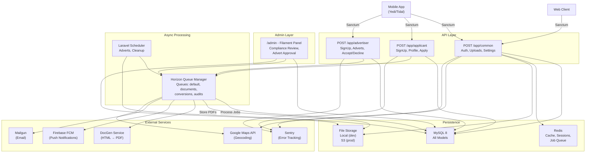
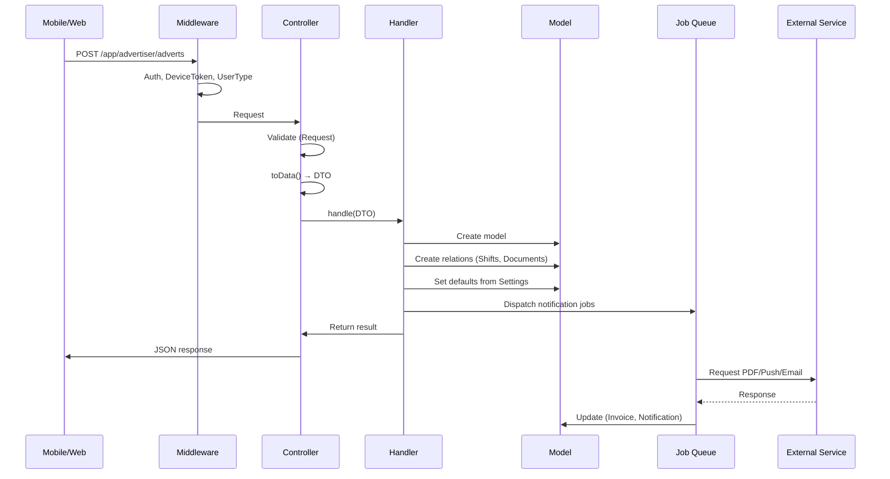
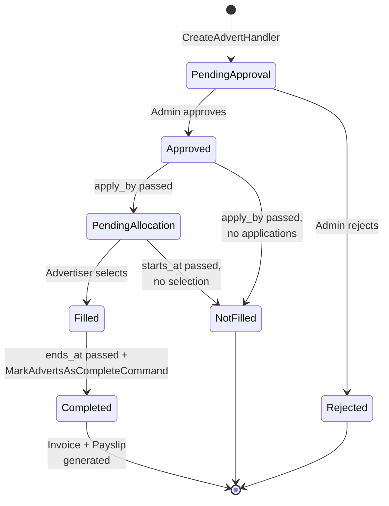
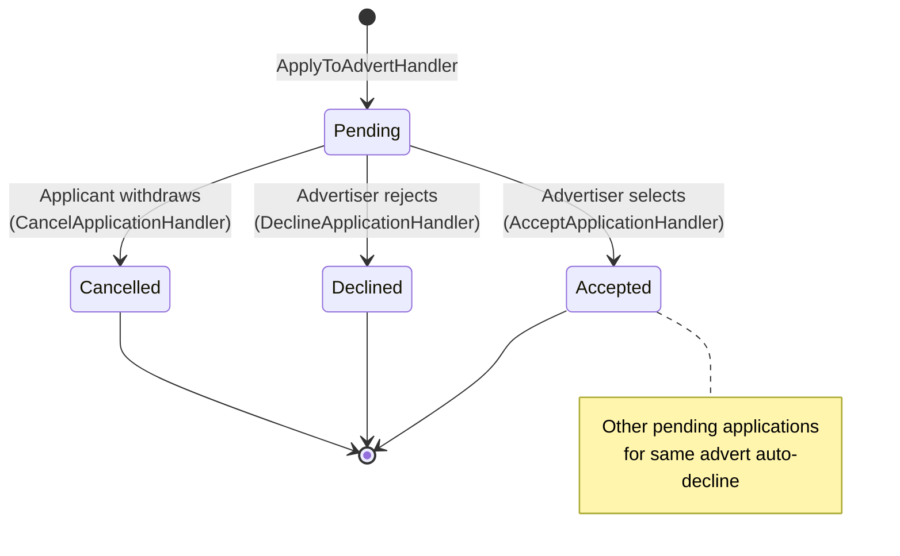
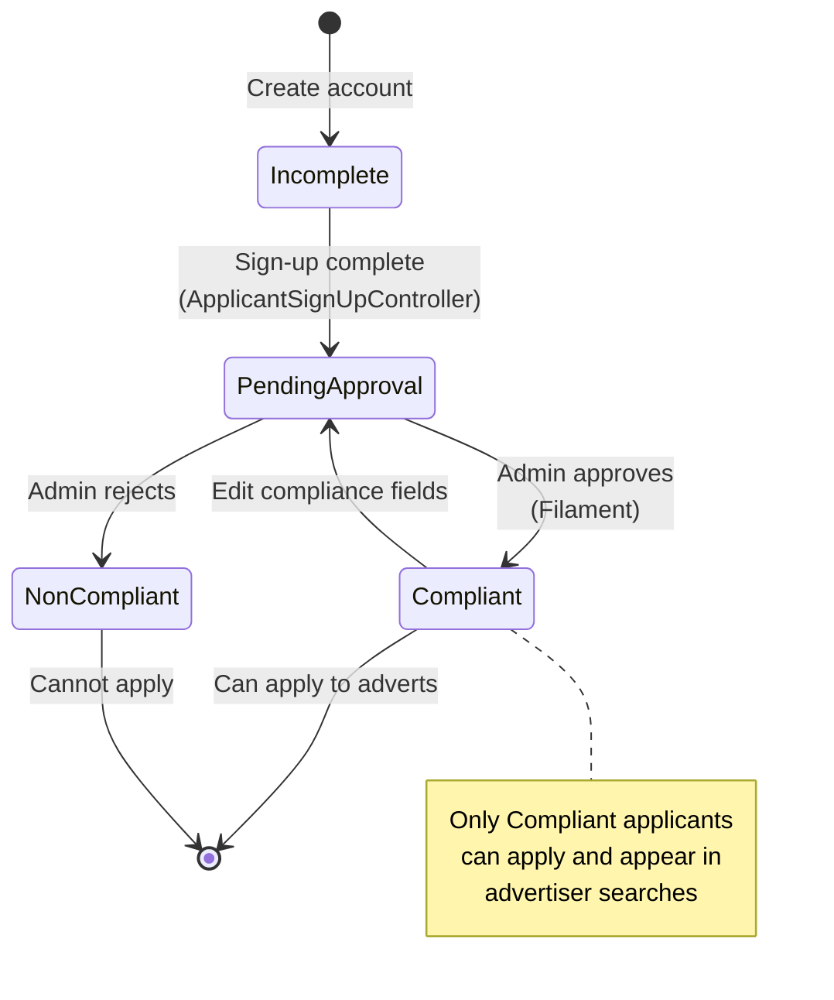

# System Architecture

**Last updated:** 2026-07-08  
**Runtime:** Laravel 11 on PHP 8.2+, MySQL 8, Redis, Filament 3 admin

## Runtime Topology



## Request Flow



## Advert Lifecycle State Machine



## Application Lifecycle State Machine



## Applicant Compliance Lifecycle



## Queue Architecture

```mermaid
graph LR
    subgraph QueueTypes ["Queue Types"]
        Default["default<br/>(general)"]
        Documents["documents<br/>(PDF generation)"]
        Conversions["conversions<br/>(Image resize)"]
        Audits["audits<br/>(Change tracking)"]
    end
    
    subgraph Redis ["Redis"]
        QueueStore["Queue Storage"]
    end
    
    subgraph Workers ["Horizon Workers"]
        W1["Worker 1"]
        W2["Worker 2"]
        WN["Worker N"]
    end
    
    subgraph Jobs ["Job Classes"]
        CreateInvoiceJob["CreateAdvertInvoiceJob"]
        CreatePayslipJob["CreateAdvertPayslipJob"]
        CreateContractJob["CreateAdvertiserContractJob<br/>CreateApplicantContractJob"]
        CreateImageJob["CreateImageConversionsJob"]
        AuditJob["Owen-It Auditing"]
    end
    
    QueueTypes -->|Enqueue| Redis
    Redis -->|Dequeue| Workers
    Workers --> Jobs
    Jobs -->|Update Models<br/>Generate Files| Persistence["MySQL, S3"]
    
    classDef queueDocs fill:#e1f5ff
    class Documents queueDocs
    class CreateInvoiceJob queueDocs
    class CreatePayslipJob queueDocs
    class CreateContractJob queueDocs
    class CreateImageJob queueDocs
```



## Database Schema (Domain-Grouped)

### Users & Auth
- **users** — Email, password, user type (Admin/Advertiser/Applicant), polymorphic userable
- **personal_access_tokens** — Sanctum tokens
- **password_reset_tokens** — Reset flow
- **sessions** — Session storage
- **device_tokens** — Firebase FCM tokens

### Adverts & Marketplace
- **advertisers** — Company profiles, compliance status, photo
- **adverts** — Job postings, rates, charges, status
- **shifts** — Individual shift times within an advert
- **applications** — Applicant → Advert join, status, rating
- **applicants** — Worker profiles, qualification, compliance status
- **types_of_work**, **job_roles** — Lookup tables

### Compliance
- **references** — Employment reference form responses
- **declarations** — Admin-defined compliance templates
- **declaration_agreements** — Applicant's agreement to declaration
- **right_to_work_declarations** — Applicant's right-to-work statement
- **required_evidence** — Admin-defined evidence requirements
- **applicant_evidence** — Submitted evidence (upload link)
- **video_verifications** — Identity video (6-digit code + upload)

### Finance & Documents
- **invoices** — Advertiser billing (per filled advert)
- **invoice_items** — Line items (per shift)
- **payslips** — Applicant pay statement
- **contracts** — Polymorphic (Advertiser or Applicant)
- **documents** — Advert attachments (polymorphic owner)

### Infrastructure
- **uploads** — File abstraction (UUID PK), signed URLs, expiry
- **image_conversions** — Resized variants (UUID PK, multiple sizes)
- **addresses** — Polymorphic geocoded locations (expires after 15 min if orphaned)
- **hearted_applicants** — Advertiser favorites (polymorphic, soft-delete)
- **settings** — Singleton config row (charge %, invoice terms, contract templates)
- **audits** — Owen-It change history (user, model, old/new values, IP, timestamp)
- **jobs**, **job_batches**, **failed_jobs**, **cache**, **cache_locks** — Framework

## External Integrations

### DocGen Connector (Saloon)
- **Service:** External HTML → PDF converter
- **Auth:** HTTP Basic (username, password)
- **Trigger:** Queued jobs (documents queue)
- **Generates:**
  - Contracts (advertiser + applicant, from Settings templates)
  - Invoices (per filled advert)
  - Payslips (per applicant, per advert)
  - Reference PDF (when referee submits form)

### Google Maps Connector (Saloon)
- **Service:** Google Maps API (Geocoding, Place Photos)
- **Auth:** API key
- **Requests:**
  - `GeocodeRequest` — Address → lat/long (cached 5 min)
  - `FindPlaceRequest` — Search text → place ID (cached 5 min)
  - `GetPlacePhotoRequest` — Place photo (not cached)
- **Trigger:** On address save (`GetAddressCoordinatesHandler`)

### Firebase (Kreait SDK)
- **Service:** Firebase Cloud Messaging
- **Channel:** Custom `Channels/FcmChannel` for notifications
- **Tokens:** Registered from `X-FCM-Token` header (DeviceTokenMiddleware)
- **Flow:** Notification → FcmChannel checks for FCM method → dispatches CloudMessage per token
- **Cleanup:** Stale tokens deleted weekly; invalid tokens removed on send failure

### Mailgun
- **Service:** Email delivery
- **Config:** Domain, secret (via mailgun config)
- **Triggers:** All notifications (mail variant)
- **Templates:** Markdown in `resources/views/mail/{audience}/*.blade.php`

### Sentry
- **Service:** Error tracking
- **DSN:** Via `SENTRY_LARAVEL_DSN`
- **Scope:** Exceptions handled globally in `bootstrap/app.php`
- **Data:** Request/user context, breadcrumbs, release version

## Authorization Patterns

### Middleware-Based (Audience Routing)
```
/app/common       → public + sanctum users (DeviceTokenMiddleware)
/app/applicant    → sanctum + user-type:applicant
/app/advertiser   → sanctum + user-type:advertiser
/admin            → authenticated + isSuperAdmin()
```

### Policy-Based (Business Logic)
- `AdvertPolicy` — view/create/apply/delete
- `ApplicationPolicy` — accept/decline/rate
- `VideoVerificationPolicy` — update own verification
- Used via `Gate::authorize()` in controllers/requests

### Field-Level (Queries)
- Applicant queries filter on `compliance_status=Compliant`
- Advertiser queries filter on `profile_status=Active`
- Soft-deleted records excluded by default (except explicit `withTrashed()`)

## Scheduling

All scheduled tasks registered in `bootstrap/app.php` (no Kernel class).

**Every 5 minutes:**
- `ClearExpiredAddressesCommand` — Delete orphaned addresses (15-min expiry)
- `ClearExpiredDeviceTokensCommand` — Delete stale tokens (1-week threshold)
- `ClearExpiredUploadsCommand` — Delete orphaned uploads (10-min expiry)

**Every minute:**
- `MarkAdvertsAsCompleteCommand` — Check ends_at, trigger invoice/payslip jobs, mark completed
- `UpdateApprovedAdvertsStatusesCommand` — Close application window (apply_by passed), notify advertiser
- `UpdatePendingAllocationAdvertsStatusesCommand` — Auto-fail allocation (starts_at passed)

## White-Label Mechanism

### Brand Switch
- **Environment:** `APP_CONFIGURATION=yedi|tidal`
- **Runtime:** `config('app.configuration')`

### Terminology Files
- `lang/en/yedi.php` → Yedi keys (Teacher, School, Job)
- `lang/en/tidal.php` → Tidal keys (Candidate, Brand, Advert)
- **Keys:** `brand`, `brand_colour`, `applicant`, `advertiser`, `advertiser-icon`, `advert`

### Resolution
- `___($key)` helper reads `config('app.configuration')`, prefixes key, calls `__($prefixed_key)`
- Fallback: if translation missing, strips prefix and tries raw key

### Views
- Landing pages: `landing-yedi.blade.php` vs `landing-tidal.blade.php`
- PDFs: `resources/views/pdfs/components/header.blade.php` checks config, renders brand logo

### Filament
- Panel brand name: `->brandName(___('brand'))`
- Primary color: `->colors(['primary' => ___('brand_colour')])`
- Icons: Some resources use `advertiser-icon` via `___()` lookup

## Performance Considerations

### Caching
- **Eloquent:** Computed attributes use `->shouldCache()` (stored in model instance, not HTTP cache)
- **Google Maps:** Responses cached 5 min (Saloon cache plugin)
- **Filament:** Native date pickers + non-native selects for accessibility
- **Session:** Database-backed (configurable via SESSION_DRIVER)

### Database
- **Indexes:** Status columns (AdvertStatus, ApplicationStatus, ComplianceStatus, ProfileStatus, etc.)
- **Marked_as_completed_at:** Indexed for quick advert completion queries
- **Soft deletes:** Default scope excludes deleted records; `withTrashed()` overrides
- **Foreign keys:** cascade/restrict configured per relation type

### Jobs
- **Queues:** Documents queue isolates PDF generation from default queue (no blocking)
- **Conversions queue:** Image resizing separate from document generation
- **Audits queue:** Change history dispatched async to not block requests
- **Workers:** Horizon runs up to 10 processes (prod) / 3 (dev); configurable per supervisor

### File Storage
- **Cleanup:** Orphaned uploads/addresses deleted on 5-min schedule
- **Signed URLs:** Generated per request; 24-hour default expiry
- **Image variants:** Multiple sizes generated async (Spatie Image, WebP)

## Monitoring & Observability

### Logs
- **Pail:** Real-time log streaming in dev (`composer run dev`)
- **Storage:** `storage/logs/laravel.log`
- **Channels:** Default `single`, also `daily`, plus custom `google_maps` channel

### Errors
- **Sentry:** Captures exceptions, breadcrumbs, user context, releases
- **Local:** `APP_DEBUG=true` shows detailed error pages (dev only)

### Queue Status
- **Horizon:** Dashboard at `/horizon` (admin-only gate)
- **Metrics:** Job counts, completion rate, failure tracking
- **Supervisors:** Named `HORIZON_SUPERVISOR` (env var)

### Database
- **Audits:** Full change history via `audits` table (Owen-It)
- **Timestamps:** `created_at`, `updated_at` on all models (except Settings, DeviceToken)
- **Soft deletes:** `deleted_at` timestamp for recovery

